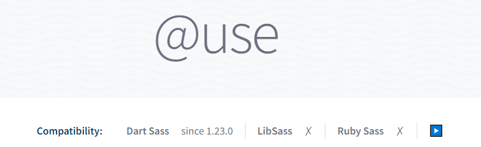
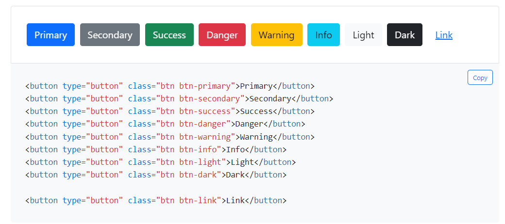

# Aprenda Sass

## Índice

**Aprenda Sass**
- Sobre esse livro
- O que é Sass?
  - Sass e CSS
  - Implementações de Sass
- Você não precisa saber nada além de CSS pra começar a usar Sass


&nbsp;

<br />

## Sobre esse livro

**O que você precisa saber antes de ler?**

- Ter experiência com CSS
- Saber usar um terminal de forma básica
- Saber instalar pacotes com `npm`, `yarn` ou afins

<br />

&nbsp;

## O que é Sass?
**Sass é o CSS que a gente já conhece extendido pra ter super poderes.** Ele possuí todas as características do CSS, porém detém um arsenal gigante de funções e recursos que permitem que a gente escreva muito mais estilos usando muito menos código. O Sass é uma linguagem pré-processada, visto que o navegador que é o ambiente que aplicações front-end habitam só aceita HTML, CSS e Javascript, então que seu código Sass possa ser usado em produção, ele precisa ser transformado em CSS.

Quando o Sass usa um recurso que não existe no CSS, como um `@mixin`, antes desse código chegar no navegador o pré-processador vai analisar todo documento, realizar todas as operações, resolver todas as condições e cálculos pra só assim transformar todo esse código em CSS puro.

Por esse motivo, discursos como "Sass é melhor que CSS" são um tanto equivocados, pois ele não compila pra **nada além de CSS**. A proposta do Sass nunca foi de ser melhor que o CSS, mas oferecer **uma melhor experiência de desenvolvimento pra quem desenvolve em CSS**.

Nas palavras da documentação oficial:

> &nbsp;
> <br/>
> _CSS on its own can be fun, but stylesheets are getting larger, more complex, and harder to maintain. This is where a preprocessor can help. Sass has features that don't exist in CSS yet like nesting, mixins, inheritance, and other nifty goodies that help you write robust, maintainable CSS. - [Sass Basics, preprocessing](https://sass-lang.com/guide)._
> <br />
> <br />
> **Tradução:**
> <br />
> _CSS puro pode ser divertido, mas folhas de estilo estão ficando maiores, mais complexos e mais difíceis de manter. É ai que um pré-processador pode ajudar. Sass tem recursos que não existem no CSS ainda, como nesting, mixins, herança e outros recursos maneiros que ajudam você a escrever CSS robusto e manutenível._
> <br />
> &nbsp;

<br />

&nbsp;

### Sass e SCSS

Sass (Syntactically Awesome Stylesheet) é o nome oficial da linguagem, SCSS (Sassy Cascading Style Sheets) é uma variação de sintaxe dessa linguagem, ou seja, apenas uma forma diferente de escrever.
No Sass, usamos identação pra demarcar onde uma propriedade ou declaração começam e acabam, já o SCSS usa uma sintaxe muito parecida com CSS, usando colchetes pra demarcar onde as regras começam e acabam.

<details>
  <summary><strong>Veja a sintaxe do SCSS</strong></summary>

```scss
@mixin button-base() {
  @include typography(button);
  @include ripple-surface;
  @include ripple-radius-bounded;

  display: inline-flex;
  position: relative;
  height: $button-height;
  border: none;
  vertical-align: middle;

  &:hover { cursor: pointer; }

  &:disabled {
    color: $mdc-button-disabled-ink-color;
    cursor: default;
    pointer-events: none;
  }
}
```
> <small> ⚠ Exemplo retirado da documentação oficial.</small>
</details>

<br />
<details>
  <summary><strong>Veja a sintaxe do Sass</strong></summary>

```sass
@mixin button-base()
  @include typography(button)
  @include ripple-surface
  @include ripple-radius-bounded

  display: inline-flex
  position: relative
  height: $button-height
  border: none
  vertical-align: middle

  &:hover
    cursor: pointer

  &:disabled
    color: $mdc-button-disabled-ink-color
    cursor: default
    pointer-events: none
```

> <small> ⚠ Exemplo retirado da documentação oficial.</small>
</details>

<br/>
Percebe como é o código é bem parecido, a não ser a ausência dos colchetes na sintaxe Sass?
<br />
<br />

> &nbsp;
> <br/>
> ⚠ Porém há uma diferença - a sintaxe do Sass não aceita expressões que abrangem multiplas linhas.
> <br/>
> &nbsp;

<br />

Exemplo:
```scss
@mixin col(
  $cols, 
  $include-margin: false,
  $border: 0,
)
    color: red;
    display: block;
```
<small>As propriedades do mixin `col()` estão sendo declaradas em várias linhas.</small>

Para que esse código funcione, ele precisa ou ser escrito em SCSS ou com todos os argumentos de `col()` em uma linha só.

&nbsp;

> &nbsp;
> <br/>
> 💡 Pra efeito de praticidade, nesse livro vou usar a sintaxe SCSS, **mas vou chamar tudo de Sass**, ok?
> <br/>
> &nbsp;

<br />

&nbsp;

### Implementações de Sass

O primeiro processador de Sass foi criada em 2006 usando Ruby, pois seus autores já tinham criado a linguagem de template [Haml](http://haml.info/) com sucesso e Ruby era a linguagem mais moderna do ecossistema naquela época. Ruby Sass foi depreciado em 2019.

&nbsp;

> &nbsp;
> <br/>
> ⚠ Se você trabalha em alguma aplicação com base em Ruby e usa a gem `sass`, você pode substituí-la pela gem [`sassc`](https://rubygems.org/gems/sassc) e [`sassc-rails`](https://rubygems.org/gems/sassc-rails) pra usar com Ruby on Rails.
> <br/>
> &nbsp;
> 
&nbsp;

O sucessor do do Ruby Sass foi o LibSass, que era feito em C++ e uma versão com implementação pra Node chamada [Node-sass](https://github.com/sass/node-sass), que rodava LibSass por debaixo dos panos.

Essa versão também foi [depreciada em 2020](https://sass-lang.com/blog/libsass-is-deprecated) pois seus problemas de compatibilidade não davam suporte à funcionalidades importantes que o Sass precisava.

A versão mais recente e recomendada é o Dart Sass. [Dart](https://dart.dev/) foi escolhido por ser rápido, uma linguagem mais fácil de se escrever do que C++ e por consequÊncia mais amigável pra que pessoas consigam contribuir com o projeto.

Quando você usa o comando `npm install sass`, é o **Dart Sass** que é instalado.

No decorrer desse livro veremos funcionalidades que foram implementadas **apenas no Dart Sass**, como as *At-rules* `@use` e `@forward`. Caso você tenha dúvida se as funcionalidades que você está usando são compatíveis com a versão de Sass do seu projeto, isso é claramente demarcado na [documentação oficial](https://sass-lang.com/documentation/#older-versions).

<br />



> &nbsp;
> <br />
> 💡 Para ler mais sobre esse tópico eu recomendo o [capítulo Sobre Sass](https://sass-guidelin.es/pt/#sobre-sass) no documento Sass Guidelines.
> <br />
> &nbsp;

<br />

&nbsp;

## Você não precisa saber nada além de CSS pra começar a usar Sass

A beleza do Sass é que você pode criar um arquivo `.scss` e escrever apenas CSS puro dentro dele, com o tempo você pode ir incrementando seu código com funcionalidades do Sass - refatorando pra usar o *nesting*, usando funções de cores, *mixins* e funções. Dito isso, se você já tem experiência com CSS mas ainda não experimentou Sass, **não deixe que isso te impeça se isso for requisito da vaga!** Sass como a maioria dos frameworks e processadores não é **nada muito além de CSS**.

Aprender e se adaptar a esses contextos não vai ser um desafio se você souber CSS, basta um pouco de prática, leitura de como a empresa está aplicando o código e auxílio da documentação e colegas de trabalho.

Digo isso porque na minha experiência nos grupos de CSS que participo, a grande parte dos problemas que as pessoas trazem lá sobre processadores e frameworks no fim são apenas problemas de CSS.

Nas minha vivência trabalhando com Sass, foram raras as vezes que as pessoas do time estavam usando todas as funcionalidades que o Sass oferece. E quando usavam, apenas o contexto do código ajudava muito a começar a entender o que ele estava fazendo, além é claro da humildade de pedir ajuda quando for necessário.


<br />

&nbsp;

## Como instalar e compilar Sass

Hoje existem muitas formas de transformar Sass em CSS. Nessa sessão vou demonstrar as mais utilizadas e as mais simples e quais são suas vantagens e desvantagens.

As formas que iremos abordar aqui são:

- [Sass CLI](#terminal)
- [Aplicações](#aplicacoes)
- [Bundlers](#bundlers)
- [Automatizadores](#automatizadores)
- [Toolings de Front-end](#toolings)
  
&nbsp;

> &nbsp;
> <br/>
> 💡 TL:DR - É muito comum você usar Sass com algum framework de Javascript como React ou Vue. Esses frameworks possuem *bundlers* que já estão realizando uma série de transformações no código e já são capazes de transformar Sass direto da caixa. Isso significa que na maioria dos frameworks de Javascript basta você instalar Sass e importar a folha de estilo `.scss` no seu arquivo.
>
> Agora, se você quer utilizar Sass em algum projeto particular sem frameworks de javascript, minha recomendação pessoal é usar o [Vite](https://vitejs.dev/guide/features.html#css-pre-processors), uma ferramenta de Javascript, ou [Parcel](https://parceljs.org/languages/sass/), um bundler.
> <br />
> &nbsp;


<br />

&nbsp;

### <a id="terminal"></a>Compilando Sass pelo terminal

O Sass oferece suporte pra compilação via terminal. Pra isso você precisa ter a dependência `sass` instalada localmente.

Pra fazer isso, abra o terminal de sua preferência e instale o Sass.

Via NPM
```
npm install -g sass
```

Via Yarn
```
yarn global add sass
```

Com o terminal na pasta raiz do seu projeto, você usa o [CLI (Interface de Linha de Comando)](https://www.hostinger.com.br/tutoriais/o-que-e-cli) do `sass`:

```bash
sass <pasta_scss>/<arquivo.scss> <pasta_css>/<arquivo.css>
```

O comando acima recebe dois argumentos separados por espaço:
- A pasta que o seu arquivo `.sass` ou `.scss` está seguida do nome arquivo com a extensão.
Ex: `styles/sass/main.scss`

- A pasta que que deverão ficar os arquivos CSS compilados do seu Sass, também com nome e extensão.
Ex: `styles/css/main.css`

Mas nesse caso, toda alteração que você fizer vocÊ vai precisar rodar o comando novamente pra visualizar as mudanças em tempo real. Pra que o Sass observe automáticamente seus arquivos e atualize a saída em CSS, você pode usar o modo `--watch`.

```
sass --watch styles/sass:styles/css
```

A flag `--watch` é responsável por colocar o Sass em modo de observação, ele recebe apenas um argumento - a pasta do seu Sass e a pasta que o CSS resultado do pré-processamento deverá ficar, separados por dois pontos `:` .

Caso você precise de usos mais complexos, o CLI do Sass possuí várias flags que podem customizar o seu uso na [documentação oficial](https://sass-lang.com/documentation/cli/dart-sass).

Pra facilitar sua vida, você pode criar um comando no `package.json` do seu projeto.

```json
[
  {
    "scripts": {
      "sass": "sass src/scss/main.scss src/css/main.css",
      "sass:watch": "sass --watch styles/sass:styles/css"
    }
  }
]

```

<br />

&nbsp;

### <a id="aplicacoes"></a>Compilando Sass com aplicações
É possível compilar Sass com auxílio de apps, inclusive já vi muitos cursos usarem esse recurso, justamente pra evitar fazer todo um setup em Javascript só pra ensinar a linguagem.
Hoje você consegue compilar Sass sem escrever uma linha de Javascript, então apps como [Scout](https://scout-app.io/) não fazem mais tanto sentido.

<br />

&nbsp;

### <a id="bundlers"></a>Compilando Sass com bundlers/builders
O *bundler* é responsável por incorporar código de dependências dentro do seu, transformando elas em HTML, CSS ou Javascript puros quando necessário.

No caso, queremos que eles transformem Sass em CSS pronto pra funcionar no navegador sem nenhum problema.

Os  mais populares são Webpack, Parcel e Rollup, mas eles não são os únicos.

Algumas aplicações React, por exemplo usam Webpack como *bundler*, mas de forma pré-configurada, então basta você instalar Sass localmente pra começar a usar. Caso você esteja usando Javascript puro ou algum outro caso em que você precise escolher e configurar o pré-processamento de Sass, eu recomendo o Parcel por ser bem mais <abbr title="Instalar e usar">*plug n' play*</abbr> que as outras alternativas.

Abaixo, tutoriais de como usar as ferramentas citadas:

**Parcel**

[Documentação](https://parceljs.org/languages/sass/)

[Tutorial em texto, por mim](https://dev.to/lixeletto/como-escrever-sass-em-2022-g68#:~:text=um%20lugar%20s%C3%B3.-,Parcel,-O%20parcel%20%C3%A9)

[Tutorial em vídeo (Gabriel Bertola no Youtube)](https://www.youtube.com/watch?v=I9Vz1TgUa3I&ab_channel=GabrielBertolaBocca)

[Tutorial em vídeo (Kevin Powell, em inglês)](https://www.youtube.com/watch?v=wYWf2m_yzBQ&ab_channel=KevinPowell)

<br />

**Rollup**

[Documentação](https://github.com/thgh/rollup-plugin-scss)

<br />

**Webpack**

[Documentação](https://webpack.js.org/loaders/sass-loader/)

[Tutorial em texto (Runebook)](https://runebook.dev/pt/docs/webpack/loaders/sass-loader)

[Tutorial em vídeo (Jimmy Cleveland, em inglês)](https://www.youtube.com/watch?v=SH6Y_MQzFVw&ab_channel=SwashbucklingwithCode)

<br />

> &nbsp;
> <br/>
> 💡 Pra uma explicação mais produnda sobre bundlers, recomendo esse artigo do [Vinicius Reis no Medium](https://blog.codecasts.com.br/ecossistema-javascript-parte-05-bundlers-builders-6809b17ddcf8)
> <br/>
> &nbsp;


<br />

&nbsp;

### <a id="automatizadores"></a>Compilando Sass com automatizadores

Automatizadores permitem que você crie uma cadeia de comandos que vão tratar determinada informação. No caso do Sass um automatizador (ou *task runner*) vai fornecer o endereço do arquivo Sass e em seguida descrever qual plugin vai processar esse arquivo. Uma vez processado, precisamos definir também pra onde esse arquivo vai.

O automatizador mais popular hoje é o [Gulp (State of Js 2022)](https://2022.stateofjs.com/en-US/libraries/), mas temos outros exemplos como Grunt e Taskr com uma estrutura parecida.

**Gulp**

[Documentação](https://gulpjs.com/docs/en/getting-started/quick-start)

[Tutorial em texto (Raphael Bernardo via Medium)](https://medium.com/gummaoficial/compilando-sass-com-gulp-ed1e5f9ed417)

[Documentação do gulp-sass, em inglês](https://github.com/dlmanning/gulp-sass)

Dos três, recomendo a documentação do `gulp-sass`.

<br />

&nbsp;

### <a id="toolings"></a>Compilando Sass com toolings de front-end

Um tooling de front-end é uma ferramenta que vem pré-configurada e carrega múltiplas funcionalidades. O [Vite.js](https://vitejs.dev/) por exemplo tem um servidor de desenvolvimento e uma build tool ao mesmo tempo.
Eu pessoalmente uso e indico esse tipo de ferramenta, principalmente o Vite e o Snowpack.

**Vite**

[Documentação](https://vitejs.dev/guide/features.html#css-pre-processors)

[Tutorial em texto, por mim](https://dev.to/lixeletto/como-escrever-sass-em-2022-g68#:~:text=aprender%20a%20linguagem.-,Vite.js,-O%20Vite%20(se))


**Snowpack**

[Documentação](https://www.snowpack.dev/guides/sass/)

[Documentação (@snowpack/plugin-sass)](https://github.com/FredKSchott/snowpack/tree/main/plugins/plugin-sass#readme)


<br />

&nbsp;

## Os padrões de escrita do Sass
Essa sessão é baseada no Sass Guidelines escrito por [Kitty Giraudel](https://kittygiraudel.com/). Não faz sentido eu apenas transcrever os padrões de escrita pra esse livro, [pois esse guia de estilo já existe](https://sass-guidelin.es/pt/) em português e é open-source, ou seja, já é constantemente atualizado por pares. Nessa sessão só vou fazer alguns comentários que considero importantes. 

Na sessão [**codificação**](https://sass-guidelin.es/pt/#formatao-e-sintaxe) que diz que é recomendado declarar `@charset 'utf-8'`, [se você vai usar apenas caracteres ASCII na sua folha de estilos (o que é extremamente provável), você pode ignorar essa recomendação](https://github.com/sass/sass/issues/1253#issuecomment-43672459).

Na sessão de [**variáveis**](https://sass-guidelin.es/pt/#variveis) há um texto importante sobre variáveis CSS e contextos globais, porém com o advento das regras `@use` e `@forward` conseguimos criar um *namespace* pra variáveis, além de que importar dessa forma fazem que as variáveis e funções fiquem restritas no contexto do arquivo, não globalmente.

Na sessão [**formatação e sintaxe**](https://sass-guidelin.es/pt/#formatao-e-sintaxe) acho interessantíssimo lê-los, porém recomendo fortemente reforçar esses padrões com linters como [Prettier](https://prettier.io/). Mesmo o Prettier automatizando essa tarefa, é importante conhecer os padrões pra decidir também quais deles faz sentido adotar, dependendo da circunstância.

Por último, eu particularmente acho isso não só aceitável como bonito quando usado com propriedades correlatas:

```scss
.container {
  height: 500px; width: 100%;
  margin: 0; padding: 2rem;
  position: relative;
  left: 0; top: 0;
}

```

<br />

> &nbsp;
> <br />
> 💡 Além do [guia de estilos do Sass](https://sass-guidelin.es/pt/), recomendo a leitura das [guidelines do CSS](https://cssguidelin.es/).
> <br />
> &nbsp;

<br />

&nbsp;

## Bora começar?

Ao invés de explorar cada tópico como se fosse uma documentação, preferi a abordagem de começar a aprender à partir de um problema. Acho injusto empurrar um "como usar Sass" sem responder o "pra que eu usaria Sass?".

A problemática é a seguinte: **precisamos fazer um componente de botão do Bootstrap**.

<br />

<figure>



<figcaption><small>O Bootstrap é feito com Sasse Javascript e jajá vamos lá fuçar como ele funciona!</small></figcaption>
</figure>

Observando o HTML do exemplo, percebemos que temos uma classe base chamada `.btn` e uma classe modificadora, ex: `.btn-dark`. A classe base contém todas as características que o botão tem, já a modificadora o tema de cores que o botão segue.

<br />

```css
.btn {
  padding: 0.375em 0.75em;
  border: none;
  border-radius: 0.25rem;
  font-size: 1rem;
  font-weight: 400;
  line-height: 1.5;
  text-align: center;
  cursor: pointer;
}
```
&nbsp;

Implementando apenas a classe base, o botão ficaria assim:
<br />


Agora podemos criar uma classe modificadora! Quando criamos variantes de um mesmo elemento, podemos definir na classe base todas as características que o elemento tem em comum e nas modificadoras apenas as suas variações.

```css
.btn-primary {
  color: #fff;
  background-color: #0d6efd;
  border-color: #0d6efd;
}
```
&nbsp;

E não só isso, botões são elementos interativos, então eles precisam de estados! Temos que criar as pseudo-classes *active*, *hover*, *focus* e *disabled*!

```css
.btn:focus {
  outline: 0;
}

.btn-primary:active {
  color: #fff;
  background-color: #0a58ca;
  border-color: #0a53be;
}

.btn-primary:focus {
  color: #fff;
  background-color: #0b5ed7;
  border-color: #0a58ca;
  box-shadow: 0 0 0 0.25rem rgb(49 132 253 / 50%);
}

.btn-primary:hover {
  color: #fff;
  background-color: #0b5ed7;
  border-color: #0a58ca;
}

.btn:disabled { opacity: .65; }

```

&nbsp;

E ficou assim:


Mas percebe que eu só fiz a base e uma variante pra cada botão e já tem um pouco mais de 40 linhas de CSS?
E só pra deixar claro, a quantidade de linhas de CSS não são problema, principalmente quando esse CSS é necessário, mas em relação à experiência de desenvolvimento, se eu adicionar alguma mudança que altere o estado `:hover`, eu vou precisar fazer em todas as variantes de botão, variável por variável num arquivo enorme de CSS.

O Sass nos dá esse poder de **escrever menos e melhor pra criar a mesma quantidade de CSS**.

<br />

&nbsp;

## Nesting

Hoje, em Fevereiro de 2023 conseguimos declarar seletores dentro de seletores no CSS [apenas no Chrome e no Safari pela nova especificação de nesting nativo](https://caniuse.com/css-nesting#:~:text=CSS%20nesting%20provides%20the%20ability,required%20a%20CSS%20pre%2Dprocessor.).

A vantagem do *nesting* (declarar seletores dentro de seletores) é a capacidade de agrupar classes e elementos da mesma forma que eles estão aninhados no HTML.

Supondo que eu tenho uma tabela com diversos inputs, labels e buttons nela, com nesting podemos declarar dessa forma:

```scss
form {
  label {

  }
  input {

  }
  button {

  }
}
```

E isso geraria o seguinte CSS:
```css
form label {}

form input {}

form button {}
```

&nbsp;

Isso não só nos economizou de escrever o seletor `form` antes de cada seletor filho, mas também demonstra uma relação visual dos elementos dentro de `form` com ele.

Mas e com seletores compostos? podemos usar o ***parent selector*** "`&`"!
Esse seletor representa o seletor pai, então ao invés de reescrevê-lo, podemos substituí-lo por esse símbolo. Dessa forma podemos usar seletores compostos, pseudo-elementos e pseudo-classes dentro dos seletores que as abrigam, exemplo:

```scss

label {
  & > input {
    &::placeholder {

    }
    &:disabled {

    }
  }
}

```

Que geraria o seguinte CSS:
```css
label > input {}

label > input::placeholder {}

label > input:disabled {}
```

&nbsp;

No caso acima conseguimos agrupar visualmente todos os inputs diretamente dentro de labels com todos os seus estados. No CSS o máximo que dá pra fazer sem nesting seria declarar essas relações linha a linha no mesmo documento ou uma imediatamente abaixo da outra.

Mas o problema de usar o nesting pra imitar o aninhamento do HTML é que nestings muito excessivos (conhecido como *overnesting*) fazem com que além dessa propriedade de agrupamento para tornar mais legível se perca, haja um acúmulo de especificidade sem necessidade.

Muitas pessoas se referem a isso como um problema inerente do Sass, quando na verdade é um problema de arquitetura de código.

Dê uma olhada nesse exemplo:

```scss
.main-page {
  header {
    .title {}
    .text {}
  }
  .container {
    form {
      input {
        .active {}
      }
    }
  }
}

```

Isso gera as seguintes classes / especificidade:

| Classe | Esspecificidade |
| ------ | --- |
| .main-page | 0, 1, 0 |
| .main-page header | 0, 1, 1 |
| .main-page header .title | 0, 2, 1 |
| .main-page header .text | 0, 2, 1 |
| .main-page .container | 0, 2, 0 |
| .main-page .container form | 0, 2, 1 |
| .main-page .container form input | 0, 2, 2 |
| .main-page .container form input .active | 0, 3, 2 |

&nbsp;

Com CSS puro, uma boa decisão de arquitetura seria criar regras de CSS agnósticas de contexto usando classes, dessa forma a gente só gera especificidade extra referenciando que uma classe está dentro de outra quando realmente tem necessidade. O problema de colocar classe em tudo é que isso gera uma carga muito grande de decisão na hora de nomear essas classes. Arquiteturas como [BEM (link para explicação no blog DPW)](https://desenvolvimentoparaweb.com/css/bem/) foram criadas pra facilitar essas decisões e explicitar na própria nomenclatura as relações entre elementos que compõe o mesmo componente (ou bloco).

Usando BEM, poderíamos resolver o problema em relação à especificidade da seguinte forma:

```css
.main-page {}

.main-page__container {}

.header {}

.header__text {}

.header__title {}

.form {}

.form__input {}

.form__input--active {}

```

&nbsp;

No código acima, separei `.main-page`, `.header` e `.form` como blocos distintos, pois esses componentes precisam funcionar também de forma independente. Se o formulário ou header de `.main-page` possuir características diferentes dos de outras páginas, faz mais sentido a gente adicionar uma classe modificadora, como `.header .header--main-page` do que criar um CSS específico. E detalhe: todos os seletores tem especificidade de apenas **0, 1, 0**.

Nesse caso a gente consegue aproveitar uma habilidade maravilhosa do parent selector `&` do Sass (o nesting nativo do CSS ainda não faz isso) de concatenar texto.

Se liga no exemplo acima escrito com Sass:

```scss
.main-page {
  &__container {

  }
}

.header {
  &__text {

  }

  &__title {

  }
}

.form {
  &__input {
    &--active {

    }
  }
}

```

Percebe que nesse caso usamos o seletor `&` pra juntar o texto "main-page" com "__container"?
Se você usa javascript, pode interpretar da seguinte forma:

```js
// eu sei que & é um nome inválido de variável, mas finge que não é

let & = ".main-page";
let container = "__container"

const className = `${&}${container}`

console.log(className) // .main-page__container

```
<br />

&nbsp;


## Variáveis

Visto isso tudo, como ficaria o botão de bootstrap após implementar o nesting?

```scss
.btn {
  padding: 0.375em 0.75em;
  border: none;
  border-radius: 0.25rem;
  font-size: 1rem;
  font-weight: 400;
  line-height: 1.5;
  text-align: center;
  cursor: pointer;

  &-primary {
    color: #fff;
    background-color: #0d6efd;
    border-color: #0d6efd;

    &:active {
      color: #fff;
      background-color: #0a58ca;
      border-color: #0a53be;
    }

    &:focus {
      color: #fff;
      background-color: #0b5ed7;
      border-color: #0a58ca;
      box-shadow: 0 0 0 0.25rem rgb(49 132 253 / 50%);
    }

    &:hover {
      color: #fff;
      background-color: #0b5ed7;
      border-color: #0a58ca;
    }
  }

  &:disabled { opacity: .65; }

  &:focus:not(:focus-visible) {
    outline: 0;
  }
}

```

&nbsp;

Percebem que algumas das propriedades declaradas se repetem algumas vezes? Valores como a cor branca no texto serão repetidos entre variantes e tons de cor pra estados como `hover` ou `focus` também serão reaproveitados entre estados.

Antes das variáveis CSS existirem, o Sass já oferecia essa funcionalidade de uma forma muito fácil e com várias particularidades interessantes.

As variáveis Sass são declaradas de forma similar ao CSS, mas ao invés do prefixo `--`, variáveis Sass são prefixadas com `$`. Elas são variáveis "frias", ou seja, elas são transformadas em valores estáticos, enquanto variáveis CSS ainda permanecem variáveis quando vão pro navegador.

Diferente do CSS, as variáveis Sass podem ser declaradas em qualquer lugar, tornando possível separar as declarações delas de todo o resto da aplicação, o que pode ser útil se você tiver uma biblioteca de *design tokens*.

&nbsp;

> &nbsp;
> <br />
> Se você não conhece o conceito de design tokens, recomendo muito ler sobre nesse artigo do [Carlos Henrique Filho pelo UX Collective no Medium](https://brasil.uxdesign.cc/o-que-s%C3%A3o-design-tokens-cd408431727d)
> <br />
> &nbsp;

&nbsp;

Como as variáveis Sass podem ser declaradas de qualquer lugar, vamos declarar no topo do arquivo, como fazemos com as de Javascript.

Sobre a conveção de nomenclatura de variáveis, elas precisam ser kebab-case, com todas as letras minúsculas.

Se tratando de cores, os padrões de nome mais comuns são misturas de generalizações históricas criadas por frameworks de CSS.

Como varios valores de variáveis podem habitar o mesmo documento, é interessante a primeira palavra exprimir a sua função, nesse caso `$color-`. O segundo valor pode ser o nome da [matiz da cor](https://pt.wikipedia.org/wiki/Matiz) seguido do seu valor de saturação/ luminosidade como no [Tailwind](https://tailwindcss.com/docs/customizing-colors), ex: `$color-rose-500`, ou podemos usar padrões que categorizam cores pelo seu papel no design, como faz o [Bootstrap](https://getbootstrap.com/docs/5.3/customize/color/) (primary, secondary, success, info, warning, danger, light e dark), ex: `$primary-` ou como o [Adam Argyle fez no seu exemplo de color-scheme](https://github.com/argyleink/gui-challenges/blob/main/color-schemes/style.css) (brand, text, surface, shadow, etc).

Mas e ai? Qual padrão usar?

Eu recomendo os dois juntos - `<matiz>-<valor>` pra definir **as cores base**, e nomes mais relacionados a contexto pra definir **os temas**.

Vou demonstrar no exemplo abaixo:

```scss
// cores base
$color-blue-500: #0b5ed7;
$color-blue-550: #0a58ca;
$color-blue-600: #0a53be;
$color-blue-700: #0d6efd;
$color-white-100: #fff;

// Tema primary
// ---------------------------------------
// Valor padrão
$primary-text-default: $color-white-100;
$primary-background-default: $color-blue-700;
$primary-border-default: $color-blue-700;

// Valor estado active
$primary-background-active: $color-blue-550;
$primary-border-active: $color-blue-600;

// Valor estado focus
$primary-background-focus: $color-blue-500;
$primary-border-focus: $color-blue-550;


// Valor estado hover
$primary-background-hover: $color-blue-500;
$primary-border-hover: $color-blue-550;

```

&nbsp;

Com as variáveis declaradas, conseguimos substituir os valores das propriedades do botão com nomes bastante declarativos:

```scss
.btn {
  padding: 0.375em 0.75em;
  border: none;
  border-radius: 0.25rem;
  font-size: 1rem;
  font-weight: 400;
  line-height: 1.5;
  text-align: center;
  cursor: pointer;

  &-primary {
    color: $primary-text-default;
    background-color: $primary-background-default;
    border-color: $primary-border-default;

    &:active {
      color: $primary-text-default;
      background-color: $primary-background-active;
      border-color: $primary-border-active;
    }

    &:focus {
      color: $primary-text-default;
      background-color: $primary-background-focus;
      border-color: $primary-border-focus;
      box-shadow: 0 0 0 0.25rem rgb(49 132 253 / 50%);
    }

    &:hover {
      color: $primary-text-default;
      background-color: $primary-background-hover;
      border-color: $primary-border-hover;
    }
  }

  &:disabled { opacity: .65; }

  &:focus:not(:focus-visible) {
    outline: 0;
  }
}
```

&nbsp;

Mas até aqui não parece que a gente escreveu tão menos CSS né? E quando criarmos as outras variantes de cor, a classe `.btn` ainda vai ficar enorme, tornando discutível a legibilidade da mesma.

Como podemos fazer pra aproveitar ainda mais as habilidades do Sass pra reaproveitar, reduzir ou simplificar nossos códigos?

<br />

&nbsp;

### Olhando pro exemplo do Bootstrap

Uma das melhores implementações de Sass que eu já vi é no famoso framework de CSS, [Bootstrap](https://getbootstrap.com/). No momento dessa publicação, o que vou mostrar aqui se refere à versão *5.3.0-alpha1*.

O Bootstrap é um framework baseado em componentes de HTML, CSS com algumas funcionalidades em Javascript. Na sua versão 4, o Bootstrap passou a ser escrito com Sass ao invés de [Less](https://lesscss.org/) (outro pré-processador de CSS). Inclusive, essa mudança foi a motivação que [levou a criação do Tailwind CSS](https://adamwathan.me/tailwindcss-from-side-project-byproduct-to-multi-mullion-dollar-business/#:~:text=the%20real%20functionality.-,One,-of%20those%20decisions).

Olhando pro exemplo do componente de botões no [estilo do Bootstrap](https://getbootstrap.com/docs/5.3/components/buttons/) que estamos fazendo, o que podemos aprender com o próprio Bootstrap?

Antes de começar a analizar, recomendo você abrir o documento `buttons.scss` e [dar uma olhada no código fonte](https://github.com/twbs/bootstrap/blob/main/scss/_buttons.scss).

O `_buttons.scss` possuí 5 classes "base" que chamaremos de blocos. Esses blocos vão abrigar elementos, modificadores e estados (pseudo-seletores).

A classe `.btn` define as variáveis dentro do escopo da classe e não globalmente, e detalhe: são classes nativas do CSS. Acredito que a preferência por classes CSS é devido a elas permanecerem "vivas" no navegador, podendo ser acessadas e alteradas em tempo de execução via Javascript e alteradas por *feature queries* como a [`@media (prefers-color-scheme: color)`](https://developer.mozilla.org/en-US/docs/Web/CSS/@media/prefers-color-scheme).

Abaixo o código da classe `.btn` do arquivo `buttons.scss` comentada. Partes que não são relevantes nesse momento foram omitidas por brevidade. Acesse o código na íntegra [nesse link](https://github.com/twbs/bootstrap/blob/main/scss/_buttons.scss#L5).

```scss
.btn {
  /* Declaração de variáveis no topo da classe */
  --#{$prefix}btn-padding-x: #{$btn-padding-x};
  --#{$prefix}btn-padding-y: #{$btn-padding-y};
  --#{$prefix}btn-font-family: #{$btn-font-family};

  /* ... */

  /* Os valores das propriedades são padronizados em variáveis, isso porque o Bootstrap quer que seja possível que você customize esses valores facilmente pra todos os botões, e não de um por um */
  display: inline-block;
  padding:
    var(--#{$prefix}btn-padding-y)
    var(--#{$prefix}btn-padding-x);
  font-family: var(--#{$prefix}btn-font-family);

  /* ... */

  /* Aqui vemos um exemplo de parent selector com pseudo-elemento, é um caso de uso bem comum que inclusive nesting nativo do CSS suporta! */

  &:hover {
    color: var(--#{$prefix}btn-hover-color);
    background-color: var(--#{$prefix}btn-hover-bg);
    border-color: var(--#{$prefix}btn-hover-border-color);
  }

  /* ... */

  /* Aqui tem um seletor composto em Sass, percebe que é possível usar o parent selector (&) em outras posições que não o início? */

  .btn-check:checked + &,
  :not(.btn-check) + &:active,
  &:first-child:active,
  &.active,
  &.show {
    /* ... */
  }

}

```

&nbsp;

Vamos analisar esse código trecho por trecho?

### Declaração de variáveis mistas (CSS + Sass)

A declaração `--#{$prefix}btn-padding-x: #{$btn-padding-x};` parece um pouco confusa, mas com um pouco de contexto ela fica mais fácil. Primeiro, vamos identificar as variáveis utilizadas (lembre-se, elas começam com `$`).

Essas variáveis estão declaradas em outro documento chamado `variables.scss` e estão sendo importadas pro `buttons.scss` (eu já explico como).

```scss
$prefix: bs- !default;
$btn-padding-x: .75rem !default;

```
<small>Obs: As variáveis não estão declaradas **exatamente** dessa forma, mas o que demonstrei aqui dá no mesmo. Como essas variáveis precisam de retrocompatibilidade e podem ser usadas em outros lugares, elas partem de definições mais complexas. Confira o documento na íntegra [nesse link](https://github.com/twbs/bootstrap/blob/main/scss/_variables.scss).</small>

&nbsp;

### Interpolação de strings

O conceito de *interpolation* é que ele recebe uma variável ou uma expressão, avalia e a transforma em texto. A declaração `--#{$prefix}btn-padding-x: #{$btn-padding-x};` avalia as variáveis `$prefix` e `$btn-padding`, retorna os seus valores e concatena com o resto da declaração.

Nesse caso, essa declaração produz o nome de variável `--bs-btn-padding-x: .75rem !default;`

O legal da interpolação é que você pode usar em quase qualquer lugar do código - seletores, nomes e valores de propriedades, *at-rules* (funções que iniciam com `@`), importações, funções e até comentários. Recomendo dar uma lida na sessão da documentação sobre esse tópico [nesse link](https://sass-lang.com/documentation/interpolation).

&nbsp;

### A flag !default

O `!default` nas variáveis é uma flag que altera o comportamento de redefinição da mesma, permitindo que você coloque outro valor nessa variável apenas quando o valor dela for **nulo ou indefinido**. Assim, podemos mudar o valor dessa variável sem alterar o código fonte importando ela através da regra `@use`.

Não vou me aprofundar mais na explicação pois vou abordar isso com mais detalhes quando falarmos de separação de arquivos e importação/ exportação com `@use` e `@forward`. Se estiver curiose, pode ler na documentação oficial [nesse link](https://sass-lang.com/documentation/variables#default-values).

&nbsp;


## Objetos e loops

Descendo um pouco mais no código fonte, podemos analizar como o Bootstrap produz as variantes, e é um código impressionantemente curto!

Código do gerador de variantes comentado:
```scss

/* Essa expressão @each é quase como um for...of do Javascript.
Pode-se ler em pseudo-código como PARA CADA <valores> EM <variável>, FAÇA:
No caso abaixo, para cada $color (chave), $value (valor) em $theme-colors (variável), ele vai executar o bloco de código dentro da iteração.
 */
@each $color, $value in $theme-colors {

  /* Aqui vemos um exemplo de interpoção da variável $color com a classe .btn-, é dessa forma que são geradas todas as classes variantes */
  .btn-#{$color} {
    /* Sim! Esse bloco é um if! Funciona exatamente como no Javascript e falaremos mais sobre ele */
    @if $color == "light" {

      /* Esse @include é um mixin, ele funciona como uma função no Javascript que recebe argumentos e retorna um bloco de CSS */
      @include button-variant(
        $value,
        $value,
        $hover-background: shade-color($value, $btn-hover-bg-shade-amount),
        $hover-border: shade-color($value, $btn-hover-border-shade-amount),
        $active-background: shade-color($value, $btn-active-bg-shade-amount),
        $active-border: shade-color($value, $btn-active-border-shade-amount)
      );
    } @else if $color == "dark" {

     /* ... */

    } @else {
      @include button-variant($value, $value);
    }
  }
}

```

O código acima itera sobre a variável `$theme-color`, usa o valor da chave `$color` pra definir a cor do tema e condicionais pra renderizar o tema *light*, *dark* ou padrão. Mas isso deixa várias perguntas:

- Se ele está iterando em uma variável, quer dizer que a variável pode ter mais de um valor?
- O que é esse `@include` e esse `shade-color()` e porque eles parecem funções?
- Onde tá todo aquele CSS que fica dentro das classes de tema, como `btn-primary` que a gente viu lá no começo?

&nbsp;

## Mapas

O valor de `$theme-color` está guardado em uma variável em `variables.scss`:

```scss
$primary:       $blue !default;
$secondary:     $gray-600 !default;
$success:       $green !default;
$info:          $cyan !default;
$warning:       $yellow !default;
$danger:        $red !default;
$light:         $gray-100 !default;
$dark:          $gray-900 !default;

$theme-colors: (
  "primary":    $primary,
  "secondary":  $secondary,
  "success":    $success,
  "info":       $info,
  "warning":    $warning,
  "danger":     $danger,
  "light":      $light,
  "dark":       $dark
) !default;
```

&nbsp;

Os conjuntos de chave e valor dentro da variável são elementos de um *Map*, que funciona de forma análoga ao objeto do Javascript. A declaração acima pode ser lida da seguinte forma:

```js

const theme_colors = {
  "primary": primary,
  "secondary": secondary,
  "success": success,
  "info": info,
  "warning": warning,
  "danger": danger,
  "light": light,
  "dark": dark
}

```

&nbsp;

E quando o `@each` itera sobre a variável, podemos escrever de forma equivalente no JS também:

```js

for ([color, index] of Object.entries(theme_colors)) {
  console.log(color, index)
}

```

Ou seja, em cada iteração, o `@each` recebe de `$theme-colors` uma chave (ex: "primary") e um valor (ex: $primary).

Mapas podem receber chaves e valores, as chaves podem ser inclusive variáveis Sass. Existem métodos pra se adicionar ou remover elementos de um mapa ou unir dois mapas diferentes, eles são `map-get()`, `map-set()` e `map-merge()` respectivamente. Veremos mais sobre esses métodos no decorrer desse livro, mas se tiver curiosidade, visite a sessão sobre na documentação oficial [nesse link](https://sass-lang.com/documentation/modules/map).

Mapas de Sass podem ter múltiplos níveis:

```scss
$theme-color: (
  primary: (
    background: $blue-500,
    color: $black-000,
  )
  secondary: (
    /* ... */
  )
)

```

&nbsp;

Que podem ser acessados da seguinte forma:

```scss
.element {
  color: map-get($theme-color, primary, color);
  background: map-get($theme-color, primary, background);
}
```
<small>Você pode ler o `map-get()` como se ele fizesse o equivalente à notação de objeto no Javascript `theme_color.primary.color`, por exemplo.</small>

&nbsp;

> &nbsp;
> <br />
> Se os exemplos de Javascript não ficaram claros pra você, tudo bem! É possível fazer uma analogia parecida com qualquer objeto e iterador que você conhecer, só usei JS pois é a linguagem que mais tenho experiência.
> <br />
> &nbsp;

&nbsp;

## Mixins

Pra entender a última peça da implementação desse gerador de temas de botão no Sass, precisamos entender o que o trecho `@include button-variant()` está fazendo.

Abaixo o código simplificado pra facilitar no entendimento, mas você pode ver a implementação na íntegra no código fonte em `mixins/buttons.scss` [nesse link](https://sass-lang.com/documentation/modules/map).

```scss
/* O mixin é como se fosse uma função que pode receber um ou mais parâmetros e retorna um trecho de CSS ou um seletor inteiro */
@mixin button-variant(
  $background,
  $border,
  $color,
  $hover-background,
  $hover-border,
  $hover-color,
  /* ... */
) {
  /* O mixin retorna todo código que estiver dentro do seu bloco (O bloco é tudo o que está dentro das chaves {}), então ele não precisa de uma palavra chave "return" */
  --#{$prefix}btn-color: #{$color};
  --#{$prefix}btn-bg: #{$background};
  --#{$prefix}btn-border-color: #{$border};
  --#{$prefix}btn-hover-color: #{$hover-color};
  --#{$prefix}btn-hover-bg: #{$hover-background};
  --#{$prefix}btn-hover-border-color: #{$hover-border};
  /* ... */
}

```

A vantagem da criação do mixin é que com ele é possível criar funções que retornam um bloco de CSS que pode estar repetido em muitas partes, mas com elasticidade o bastante pra que suas propriedades e valores possam ser customizados via propriedades.

Como você pode ter percebido, nem todas as invocações desse mixin recebiam todos esses parâmetros (ex: `@include button-variant($value, $value);`), isso porque é possível definir certos parâmetros como opcionais!

Para usar um mixin, usamos a *at rule* `@include <nome-do-mixin>();`.

```scss
  /* A propriedade abaixo recebe a variável $background se você não fornecer $color como argumento. Na ausência dessa definição de opcional, a propriedade é tratada como obrigatória e retorna erro na sua ausência */
@mixin button-variant(
  $background,
  $border,
  $color: $background,
) {
  /* ... */
}

/* Uso */

.btn-primary {
  @include button-variant(red, black);
}

```

Mixins podem receber blocos também! Funciona um pouco como o `yield` da linguagem Ruby.

```scss
@mixin button-variant($color) {
  color: $color;
  @content;
}

/* Ao usar */
.btn-primary {
  @include button-variant(red) {
    border: 1px solid black;
  };
}

/* E produz o seguinte CSS
   .btn-primary {
    color: red;
    border: 1px solid black;
   }
*/

```

Mixins também argumentos indeterminados e blocos de `@content` podem receber parâmetros também, vamos ver essas funções mais a frente, mas se tiver curiosidade elas ficam [nesse link da documentação oficial](https://sass-lang.com/documentation/at-rules/mixin).

<br />

&nbsp;

## Criando um gerador de variantes com Maps e Loops

Vimos como o Bootstrap replica os temas gerando diversas classes à partir de mapas e mixins, vamos implementar passo-a-passo de forma mais simplificada no exemplo que estamos construindo?

<details>
<summary>Se você precisar relembrar o código, clique aqui!</summary>

&nbsp;
```scss

// Cores base
$color-blue-500: #0b5ed7;
$color-blue-550: #0a58ca;
$color-blue-600: #0a53be;
$color-blue-700: #0d6efd;
$color-white-100: #fff;

// Tema primary
// ---------------------------------------
//Padrão
$primary-text-default: $color-white-100;
$primary-background-default: $color-blue-700;
$primary-border-default: $color-blue-700;

// Estado active
$primary-background-active: $color-blue-550;
$primary-border-active: $color-blue-600;

// Estado focus
$primary-background-focus: $color-blue-500;
$primary-border-focus: $color-blue-550;


// Estado hover
$primary-background-hover: $color-blue-500;
$primary-border-hover: $color-blue-550;

.btn {
  padding: 0.375em 0.75em;
  border: none;
  border-radius: 0.25rem;
  font-size: 1rem;
  font-weight: 400;
  line-height: 1.5;
  text-align: center;
  cursor: pointer;

  &-primary {
    color: $primary-text-default;
    background-color: $primary-background-default;
    border-color: $primary-border-default;

    &:active {
      color: $primary-text-default;
      background-color: $primary-background-active;
      border-color: $primary-border-active;
    }

    &:focus {
      color: $primary-text-default;
      background-color: $primary-background-focus;
      border-color: $primary-border-focus;
      box-shadow: 0 0 0 0.25rem rgb(49 132 253 / 50%);
    }

    &:hover {
      color: $primary-text-default;
      background-color: $primary-background-hover;
      border-color: $primary-border-hover;
    }
  }

  &:disabled { opacity: .65; }

  &:focus:not(:focus-visible) {
    outline: 0;
  }
}
```
</details>


<br />

&nbsp;

## Funções no Sass

Primeiro, vamos criar Mapas com as variáveis pra que elas se tornem objetos iteráveis, pra brevidade esse exemplo vamos fazer apenas duas variantes, mas a vantagem de se usar mapas é poder implementar qualquer quantidade apenas mexendo no *Map*.

```scss

$color-blue-500: #0b5ed7;
$color-blue-550: #0a58ca;
$color-blue-600: #0a53be;
$color-blue-700: #0d6efd;
$color-white-100: #fff;

$btn-theme: (
  primary: (
    default: (
      text: $color-white-100,
      background: $color-blue-700,
      border: $color-blue-700
    ),
    active: (
      text: $color-white-100,
      background: $color-blue-550,
      border: $color-blue-600
    ),
    hover: (
      text: $color-white-100,
      background: $color-blue-500,
      border: $color-blue-550
    ),
    focus: (
      text: $color-white-100,
      background: $color-blue-500,
      border: $color-blue-550
    ),
  ),
  /* ... */
)

```

&nbsp;

Eu recomendo muito essa forma de fazer quando os valores pra cada estado são muito específicos ou definidos de forma **manual**, não de forma **proporcional**. Quando falo proporcional, eu quero dizer algo como "pra cada interação eu quero que a luminosidade dessa cor diminua 30%". Trabalhando com a cor dessa forma, conseguimos criar todas variantes partindo apenas de um mapa de cores base.

No caso do Bootstrap, eles usam de funções de cor do Sass pra fazer essa transformação das cores base, por isso que o objeto que eles usam (`$theme-colors`) é tão menor do que o que nós estamos usando.

Perceba como o mixin `button-variant()` recebe as propriedades relacionadas aos seus estados *default*, *hover* e *active*:

```scss
// Variável Theme-colors em variables.scss
$theme-colors: (
  "primary":    $primary,
  "secondary":  $secondary,
  "success":    $success,
  "info":       $info,
  "warning":    $warning,
  "danger":     $danger,
  "light":      $light,
  "dark":       $dark
) !default;

/* Na primeira iteração, $color será "primary" e $value será $primary (a variável contendo a cor) */
@each $color, $value in $theme-colors {
  /* ... */
  @include button-variant(
    $value,
    $value,
    $hover-background: shade-color($value, $btn-hover-bg-shade-amount),
    $hover-border: shade-color($value, $btn-hover-border-shade-amount),
    $active-background: shade-color($value, $btn-active-bg-shade-amount),
    $active-border: shade-color($value, $btn-active-border-shade-amount)
  );
  /* ... */
}
```

&nbsp;

Para as propriedades dos estados (hover, active, focus), o mixin recebe o resultado da função `tint-color()` (mistura a cor base com branco, clareando-a) ou `shade-color()` (mistura a cor base com preto, escurecendo-a) que está no arquivo [`functions.scss`](https://github.com/twbs/bootstrap/blob/main/scss/_functions.scss#L205). Mas o que são essas funções?

Quando olhamos a declaração dessa função, vemos que elas são funções puras do Bootstrap que apenas retornam a função `mix()`, uma função interna do Sass.

```scss

@function tint-color($color, $weight) {
  @return mix(white, $color, $weight);
}


@function shade-color($color, $weight) {
  @return mix(black, $color, $weight);
}

```
&nbsp;

Sass possuí diversas funções internas (*built-in*) como `mix()`, as funções que vimos anteriormente pra manipular *maps* como `map-get()`, `map-set()` e `map-merge()` também fazem parte da API do Sass.

> &nbsp;
> <br />
> A função `mix()` recebe 3 argumentos - os primeiros dois são as cores a serem misturadas, o terceiro é a porcentagem que a primeira cor receberá da segunda.
>  
> No exemplo anterior escurecemos ou clareamos as cores base misturando elas com preto ou branco, mas podemos fazer muito mais!
>
> Além de mix, podemos usar [`darken()`](https://sass-lang.com/documentation/modules/color#darken) ou [`lighten()`](https://sass-lang.com/documentation/modules/color#lighten) que recebem a cor base e a porcentagem a se escurecer ou clarear, porém essas funções [produzem uma quantidade mais limitada de cores](https://codepen.io/emdeoh/pen/zYOQOPB).
> <br />
> &nbsp;

&nbsp;

Caso queira conhecer todas as funções disponíveis, o Sass abriga elas na aba [*Built-in modules*](https://sass-lang.com/documentation/modules). Até esse momento, existem funções de cores, listas, mapas, matemáticas, meta (funcionalidades internas do Sass), seletores e manipulação de string.

Essas funções declaradas com a regra `@function` são helpers criados pelas pessoas desenvolvedoras do Bootstrap pra customizar a implementação das funções do Sass.

As funções no Sass são declaradas com `@function()` podem receber uma quantidade fixa ou arbitrária de argumentos. Diferente de mixins que retornam blocos de CSS, funções retornam **apenas valores**. Pra retornar um valor, as funções precisam terminar com a palavra chave `@return` seguida do valor de retorno.

No caso do nosso botão simplificado, podemos nos basear na variável `$theme-color` do Bootstrap, mas gerar as cores das nossas variantes de forma mais direta.

```scss
$primary: #0d6efd;
$secondary: #6c757d;
$success: #198754;
$info: #0dcaf0;
$warning: #ffc107;
$danger: #dc3545;
$light: #f8f9fa;
$dark: #212529;

$theme-colors: (
  "primary":    $primary,
  "secondary":  $secondary,
  "success":    $success,
  "info":       $info,
  "warning":    $warning,
  "danger":     $danger,
  "light":      $light,
  "dark":       $dark
);

@each $color, $value in $theme-colors {
  .btn-#{$color} {
    color: $light;
    background-color: $value;
    border-color: $value;
    &:hover {
      color: $light;
      background-color: mix(black, $value, 20%);
      border-color: mix(black, $value, 20%);
    }
    &:is(:focus, :focus-visible) {
      outline: 0;
      color: $light;
      background-color: mix(black, $value, 20%);
      box-shadow: 0 0 0 0.25rem mix(black, $value, 20%);
    }
    &:active {
      color: $light;
      background-color: mix(black, $value, 25%);
      border-color: mix(black, $value, 25%);
    }
  }
}

```

&nbsp;

Pra ficar mais claro o que tá rolando nesse loop, abaixo uma demonstração do Sass gerado na primeira iteração:

```scss
/* Na primeira iteração a $color vai ser a string "primary" e $value vai ser a variável $primary */

// A classe recebia uma interpolação de .btn- + $color

.btn-primary {
    // color recebe a variável $light que foi declarada no escopo do documento, logo é acessível
    color: $light;
    background-color: $primary;
    border-color: $primary;

    // Todas as ocorrências de $value recebem $primary nessa iteração
    &:hover {
      color: $light;
      background-color: mix(black, $primary, 20%);
      border-color: mix(black, $primary, 20%);
    }
    &:is(:focus, :focus-visible) {
      outline: 0;
      color: $light;
      background-color: mix(black, $primary, 20%);
      box-shadow: 0 0 0 0.25rem mix(white, $primary, 30%);
    }
    &:active {
      color: $light;
      background-color: mix(black, $primary, 25%);
      border-color: mix(black, $primary, 25%);
    }
  }
```

&nbsp;

Agora com base em um mapa de cores iniciais, geramos todas às variantes da classe `.btn-<color>`, agora basta aplicar essas classes geradas no HTML!

Pra finalizar, o próximo passo é separar as declarações de variáveis em outro documento, como as variantes são geradas à partir dessas variáveis, é interessante mantê-las centralizadas em um documento que funcionará como painel de controle dos estilos.

&nbsp;

> &nbsp;
> <br/>
> 💡 `:is()` é uma pseudo-classe nativa do CSS, caso não conheça, recomendo muito a leitura da [documentação no MDN](https://developer.mozilla.org/en-US/docs/Web/CSS/:is) (juro que está bem legível e tem exemplos!).
> <br/>
> &nbsp;

&nbsp;

<br />

## Imports e exports com @use, @forward e @import

Você pode ter notado que eu citei diversos documentos de `scss` que contém variáveis, operações cou classes importantes na construção de um botão. Vimos um arquivo contendo apenas mixins em `/mixins/_button.scss`, um arquivo contendo apenas variáveis `_/variables.scss` e o próprio componente de botão, o `/_button.scss`.

O Bootstrap usa a *at-rule* `@import` pra carregar todos os arquivos que compõe o framework no documento `bootstrap.scss`.

```scss
@import "mixins/banner";
@include bsBanner("");


// scss-docs-start import-stack
// Configuration
@import "functions";
@import "variables";
@import "maps";
@import "mixins";
@import "utilities";

// Layout & components
@import "root";
@import "reboot";
@import "type";
@import "images";
@import "containers";
@import "grid";
@import "tables";

/* ... */
```

&nbsp;

Diferente do `@import` do CSS que faz uma requisição pra cada documento de CSS importado, o Sass faz com que **todo conteúdo importado seja concatenado ao documento que importou**. Ou seja, após a compilação, todo o código de todos arquivos importados em `bootstrap.scss` estarão nele.

Os arquivos podem ser referenciados sem sua extensão e as *URLs* são importadas de forma relativa por padrão, então você não precisa usar o `./` antes de cada arquivo.

O Sass criou seu *import* dessa forma pra que fosse possível a organização de funcionalidades em documentos separados sem precisar de requisições pra cada um deles, melhorando a performance do site.

O Bootstrap escolheu fazer um *import* em cada linha, mas é possível fazer todos de uma vez, separando por vírgulas:

```scss
@import "functions", "variables", "maps", "mixins", "utilities";

```

&nbsp;

Como o `@import` insere o código do arquivo importado exatamente onde ele foi declarado, a ordem em que você importa esses arquivos é importante, pois se você criar um arquivo que necessita de variáveis que você declarou em outro arquivo, se eles não forem carregados na ordem correta, o compilador vai apontar a variável como indefinida e gerar um erro. Mas uma vantagem sobre a questão do código ser inserido onde sua importação foi declarada é que podemos escopar a importação de um trecho de código em uma classe ou *media query*. [A documentação](https://sass-lang.com/documentation/at-rules/import#nesting) fala que é interessante usar essa funcionalidade pra importar folhas de estilos de terceiros dentro de um escopo.

```scss
// Em main.scss

@media (max-width: 440px) {
  // O código de mobile.scss será inserido aqui
  @import "mobile";
}

```
<small>Conheço pouca gente que sabe disso, mas é muito útil pra quem ainda segue os padrões de mobile first.</small>

Alguns arquivos que mencionei aqui tem um underline (`_`) na frente do nome. No Sass chamamos esses arquivos de *partials*. Ao usar essa convenção, sinalizamos pro Sass que ele não precisa tentar compilá-los individualmente pois eles serão importados em outros arquivos.

Se você quiser separar seus arquivos Sass em pastas, você pode criar um arquivo `_index.scss` importando todos arquivos da pasta e importar a pasta toda no seu arquivo de Sass principal com `@import "<nome-da-pasta>"`

É possível também realizar imports do CSS em um arquivo Sass (aquele import que faz a requisição), pra isso, basta colocar a extensão do arquivo `.css`. URLs externas, imports feitos com `url()` e imports com media queries **também são tratados como importações nativas de CSS**.

Lembra da interpolação que comentei anteriormente? É possível fazer na importação também! Abaixo, um caso de uso bem legal [extraído na íntegra da dcoumentação oficial](https://sass-lang.com/documentation/at-rules/import#nesting).

```scss
@mixin google-font($family) {
  /* Lembra que podemos importar até dentro do escopo de alguma classe ou função? */
  @import url("http://fonts.googleapis.com/css?family=#{$family}");
}

@include google-font("Droid Sans");

```

&nbsp;

Bacana né? Então, eu não recomendo usar `@import`, nem a [documentação oficial](https://sass-lang.com/documentation/at-rules/import#nesting:~:text=%E2%9A%A0%EF%B8%8F-,Heads%C2%A0up!,-The%20Sass%20team).
O time do Sass está [gradualmente deixando de dar suporte a essa funcionalidade](https://github.com/sass/sass/blob/main/accepted/module-system.md#timeline), o suporte só continuará até que 80% da base de usuários esteja usando Dart Sass.

Os motivos são importantes não só pra entender os problemas do `@import`, mas como o ecossistema de importação do Sass funciona no geral:

- @import faz com que todas as variáveis, mixins e funções sejam acessíveis globalmente. Isso dificulta muito que pessoas ou ferramentas saibam a procedência dessas coisas.

- As biblitecas precisam prefixar os nomes das coisas pra evitar colisões de nomenclatura, pois tudo é global.

- `@extend` (vamos falar dele em breve) também é global, o que torna difícil prever que estilos serão estendidos.

- Cada folha de estilos Sass é executada e seu CSS é emitido cada vez que a importação dela acontece, o que aumenta o tempo de compilação e tamanho do código.

- Não é possível declarar membros privados ou inacessíveis.

No lugar de `@import` é recomendado o `@use`, que foi criado pra resolver todos esses problemas.

&nbsp;

<br/>

### O @use e a volta do !default

No código dos botões declaramos variáveis contendo cores tema e um *Map* contendo essas variáveis com seus nomes, faz muito sentido abrigar essas variáveis no seu próprio documento, dessa forma toda vez que precisarmos alterar variáveis, saberemos onde encontrar. Como as variáveis geralmente são usadas só pra importar pra outros documentos, recomendo criar o arquivo como uma *partial*, ou seja, `_variables.scss`.

```scss
// _variables.scss

$primary: #0d6efd;
$secondary: #6c757d;
$success: #198754;
$info: #0dcaf0;
$warning: #ffc107;
$danger: #dc3545;
$light: #f8f9fa;
$dark: #212529;

$theme-colors: (
  "primary":    $primary,
  "secondary":  $secondary,
  "success":    $success,
  "info":       $info,
  "warning":    $warning,
  "danger":     $danger,
  "light":      $light,
  "dark":       $dark
);

```

&nbsp;

Agora incluímos o arquivo no nosso arquivo principal, o `_buttons.scss` usando a *at-rule* `@use`. Inicialmente, podemos só passar a URL do arquivo exatamente como no `@import`. Diferente do seu antecessor, o `@use` importa variáveis, funções e mixin de outro módulo **usando o nome seu arquivo de origem como *namespace***.

```scss
// _buttons.scss

@use "variables";

.btn {
  color: variables.$primary;
}

```
&nbsp;

Podemos também criar nosso próprio *namespace* usando a palavra chave `as` seguida de um nome sem aspas:

```scss
// _buttons.scss

@use "variables" as v;

.btn {
  color: v.$primary;
}

```

&nbsp;

Se não há riscos de colisão de nomes, podemos importar sem um namespace usando * como nome:

```scss
// _buttons.scss

@use "variables" as *;

.btn {
  color: $primary;
}

```

&nbsp;

Agora vou apresentar um problema hipotético - precisamos criar um novo documento de botões, mas com uma paleta de cores completamente diferente, chamaremos de `_dark-buttons`. Uma solução seria criar variáveis para as novas cores em `_variables.scss` e um *map* pra elas tal vomo na variável `$theme-colors`, certo?

Mas com `@use` podemos configurar valores de variáveis ou mixins de arquivos importados usando o `with()`:

```scss
// _dark-buttons.scss
$dark-blue: darkblue;
$dark-blue: darkgray;

@use "variables" with(
  $theme-colors: (
    "primary": $dark-blue,
    "secondary": $dark-gray,
    /* ... */
  )
);

```
&nbsp;

Mas pra que isso possa acontecer, precisamos da flag `!default` no *map* de `$theme-colors` pra torná-la configurável:

```scss
$theme-colors: (
  "primary":    $primary,
  "secondary":  $secondary,
  "success":    $success,
  "info":       $info,
  "warning":    $warning,
  "danger":     $danger,
  "light":      $light,
  "dark":       $dark
) !default;

```
